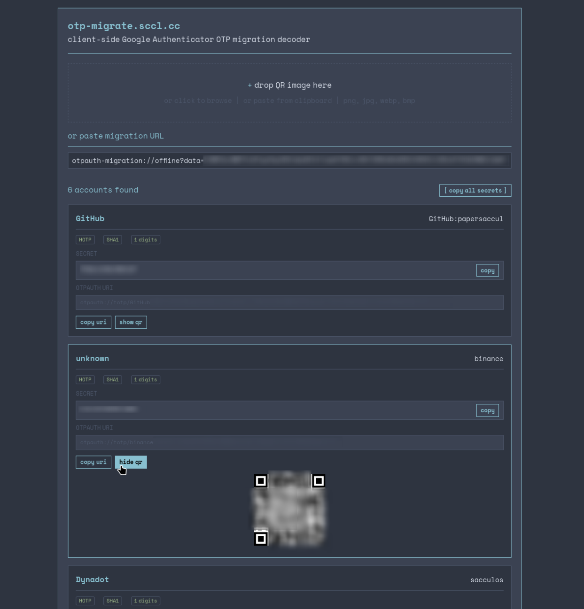

# otp-migrate.sccl.cc

Client-side Google Authenticator OTP migration decoder.



## What it does

Google Authenticator exports accounts as a single QR using the `otpauth-migration://` URI scheme - a google-specific protobuf format. Other apps (Bitwarden, Authy, Aegis) don't understand it.

This tool decodes that format and gives you standard `otpauth://` keys that work everywhere.

## How to use

1. Open Google Authenticator -> Settings -> Export accounts
2. Select accounts -> you'll get a big QR code
3. Go to [otp-migrate.sccl.cc](https://otp-migrate.sccl.cc)
4. Drop/upload the QR image or paste the `otpauth-migration://` URL
5. Get individual `otpauth://` URIs and QR codes for each account
6. Import into Bitwarden, Authy, or any TOTP-compatible app

## Privacy

All processing happens client-side. No data is sent to any server.

## Deploy

Static site built with [Zine](https://zine-ssg.io), deployed to Cloudflare Pages via GitHub Actions.

### Required GitHub Secrets

| Secret | Where to get |
|---|---|
| `CLOUDFLARE_API_TOKEN` | [dash.cloudflare.com/profile/api-tokens](https://dash.cloudflare.com/profile/api-tokens) - create with `Cloudflare Pages: Edit` permission |
| `CF_ACCOUNT_ID` | [dash.cloudflare.com](https://dash.cloudflare.com) -> right sidebar -> Account ID |

### Local dev

```bash
npm run dev   # dev server
npm run build # build to public/
```

Push to `main` -> auto-deploy via GitHub Actions.

## Stack

- [Zine](https://zine-ssg.io) - static site generator
- [jsQR](https://github.com/cozmo/jsQR) - QR code scanning
- [qrcode-generator](https://github.com/kazuhikoarase/qrcode-generator) - QR code generation
- Cloudflare Pages - hosting
